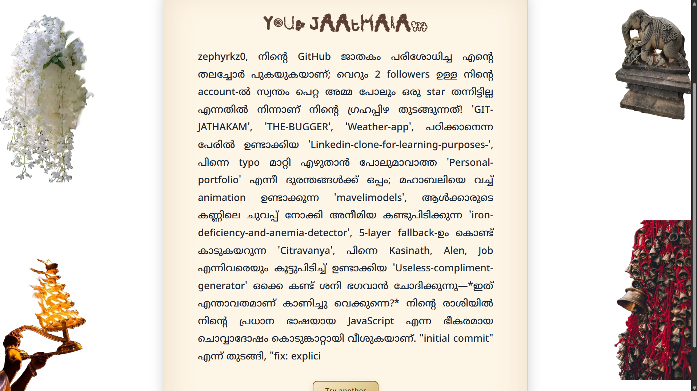

# GITHUB JAATHAKAM 🎯


## Basic Details
### Team Name: Null_x86


### Team Members
- Team Lead: Kasinath R - [Cochin University College Of Engineering Kuttanadu]

### Project Description
Jaathakam is an absolutely useless, highly judgmental, AI-powered astrology app that reads your GitHub profile like a palm and brutally roasts your coding habits in multiple languages (English, Malayalam).

### The Problem (that doesn't exist)
The developer ecosystem is far too professional. GitHub is full of "clean code" and green squares. We desperately needed an overly dramatic neighborhood astrologer to confirm our imposter syndrome using AI astrology.

### The Solution (that nobody asked for)
We ping the GitHub API to stalk your commit history, use a highly sophisticated "Stat Engine" to categorize your goblin-like behavior (e.g. "Fork Hoarder"), and then force Google's Gemini LLM to write a cursed horoscope. Finally, we use Sarvam AI to scream the roast at you.

## Technical Details
### Technologies/Components Used
For Software:
- HTML, CSS, JavaScript (Vanilla DOM manipulation)
- Express.js (deployed via Vercel Serverless Functions)
- @google/genai, axios, cors
- Vercel, Git, VS Code

For Hardware:
no hardware

### Implementation
For Software:
# Installation
```bash
git clone https://github.com/zephyrkz0/GIT-JATHAKAM.git
cd GIT-JATHAKAM
npm install
```

# Run
```bash
# Add your API keys to .env first:
# GEMINI_API_KEY=your_key
# SARVAM_API_KEY=your_key
node local-server.js
```

### Project Documentation
For Software:

# Screenshots (Add at least 3)

*The Welcome Screen: Ready to read the stars of your repositories.*


*The Grand Roast: Our AI brutally judging your GitHub history.*


*The Dramatic Setup: Select your language and let the stars decide your fate.*

# Diagrams

```mermaid
graph TD
    User[User (Frontend)] -->|Inputs Username| UI[Browser Interface]
    UI -->|POST /api/jaathakam| Backend[Vercel Serverless API]
    
    Backend -->|Fetch Repository Stats| GitHub[GitHub API]
    GitHub -->|Returns Raw Data| Backend
    
    Backend -->|Analyze Activity| StatEngine[Statistics Engine]
    StatEngine -->|Generates Facts| Backend
    
    Backend -->|Send Facts & Prompt| Gemini[Google Gemini 3.6 Flash]
    Gemini -->|Returns Horoscope Roast| Backend
    
    Backend -->|JSON Response| UI
    
    UI -->|Request TTS Audio| TTSApi[POST /api/tts]
    TTSApi -->|Send Roast Text| Sarvam[Sarvam AI API]
    Sarvam -->|Returns Audio Stream| TTSApi
    TTSApi -->|Audio Playback| User
```

### Project Demo
# Video
[N/A]
*Not Applicable: No video demonstration provided.*

# Project link
[👉 Try the live demo right here!](https://git-jathakam.vercel.app/)

## Team Contributions
- Zephyr: Full Stack Developer (Solo Developer responsible for frontend UI, Express.js backend, and AI API integrations).

---
Made with ❤️ at TinkerHub Useless Projects 


